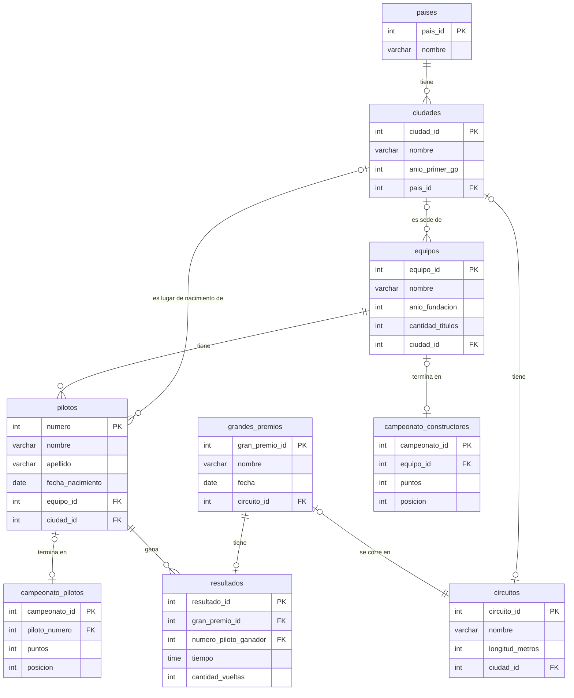

# Base de datos de la temporada 2024 de Fórmula 1

Base de datos en MySQL con la temporada 2024 de Fórmula 1: pilotos, equipos, circuitos, grandes premios, ganadores de cada carrera y los campeonatos de pilotos y de constructores.

Trabajo práctico final individual (4° año, ciclo lectivo 2024) en la Escuela Técnica N° 35 "Ing. Eduardo Latzina".

## Sobre el proyecto

Lo hice en 2024 y fue mi primer proyecto con una base de datos de este tamaño: 9 tablas relacionadas entre sí con la temporada completa, desde las 24 carreras y sus ganadores hasta la posición final de cada piloto y de cada equipo.

A diferencia de la [base de datos de la escuela](https://github.com/benipach/bd-escuela), que hicimos en grupo en 2025, este fue un trabajo individual: el modelo, la normalización, las restricciones y las consultas los hice yo solo.

Elegí la Fórmula 1 porque soy fanático desde hace varios años y me pareció un tema interesante para trabajar con datos reales, en vez de inventarlos.

## El problema

La información de una temporada de Fórmula 1 está repartida: quién corre en cada equipo, dónde está cada circuito, quién ganó cada carrera y cómo terminaron los campeonatos. El objetivo es reunir todo en una sola base, sin datos repetidos, para poder cruzarlos con consultas, por ejemplo cuántas carreras ganó cada equipo o de qué países salieron los ganadores.

### Supuestos

- Cada piloto pertenece a un solo equipo. Los que corrieron para más de uno en el año figuran en el equipo donde hicieron más carreras.
- Los pilotos se identifican por su número.
- Cada circuito está en una ciudad, y cada ciudad tiene un solo circuito.
- Cada circuito tiene un solo gran premio en la temporada, y cada gran premio, un solo resultado (el ganador, el tiempo y las vueltas).
- Las ciudades se usan para tres cosas: dónde está cada circuito, dónde tiene su sede cada equipo y dónde nació cada piloto.
- El país de un piloto es el de su ciudad de nacimiento, no su nacionalidad deportiva.
- Se considera solo la temporada 2024, con los puntos y las posiciones finales.

Quedan afuera los resultados completos de cada carrera (solo se guarda el ganador), las clasificaciones y las carreras sprint.

## Modelo

**Diagrama entidad-relación**



| Tabla | Qué guarda |
|---|---|
| `paises` | Países de las ciudades. |
| `ciudades` | Ciudades con su país y el año del primer gran premio que se corrió ahí, si hubo alguno. |
| `equipos` | Los 10 equipos, con su año de fundación, títulos de constructores y ciudad sede. |
| `pilotos` | Los 24 pilotos que corrieron en 2024, con su equipo y ciudad de nacimiento. |
| `circuitos` | Circuitos del calendario, con su longitud y ciudad. |
| `grandes_premios` | Las 24 carreras de la temporada, con su fecha y circuito. |
| `resultados` | El ganador de cada gran premio, con el tiempo y la cantidad de vueltas. |
| `campeonato_pilotos` | Posición final y puntos de cada piloto. |
| `campeonato_constructores` | Posición final y puntos de cada equipo. |

### Normalización

La base está en tercera forma normal. Por ejemplo, si la tabla de pilotos guardara también la ciudad y el país de nacimiento, esos datos dependerían de la ciudad y no del piloto, así que van en la tabla `ciudades` (2FN). Y como el país depende de la ciudad y no de la clave del piloto, va en su propia tabla, `paises` (3FN). El paso a paso con ejemplos está en la [documentación](docs/documentacion.pdf).

### Restricciones

Cada clave foránea tiene definido qué pasa cuando se borra el registro al que apunta:

| Tabla | Clave foránea | Al borrar | Por qué |
|---|---|---|---|
| `ciudades` | `pais_id` | `CASCADE` | Una ciudad sin país quedaría huérfana. |
| `equipos` | `ciudad_id` | `SET NULL` | El equipo sigue existiendo aunque se borre su ciudad sede. |
| `pilotos` | `equipo_id` | `CASCADE` | No tiene sentido un piloto sin equipo. |
| `pilotos` | `ciudad_id` | `SET NULL` | El piloto sigue existiendo, pero pierde su ciudad de nacimiento. |
| `circuitos` | `ciudad_id` | `SET NULL` | El circuito sigue existiendo, pero sin ciudad asociada. |
| `grandes_premios` | `circuito_id` | `CASCADE` | Un gran premio sin circuito rompería la integridad de los datos. |
| `resultados` | `gran_premio_id` | `CASCADE` | El resultado depende del gran premio. |
| `resultados` | `numero_piloto_ganador` | `CASCADE` | Evita resultados con un ganador que ya no existe. |
| `campeonato_pilotos` | `piloto_numero` | `SET NULL` | El puesto en el campeonato se mantiene aunque se borre el piloto. |
| `campeonato_constructores` | `equipo_id` | `SET NULL` | El puesto en el campeonato se mantiene aunque se borre el equipo. |

Además, el tiempo de cada carrera es de tipo `TIME` y las fechas son `DATE`, así que la base rechaza valores fuera de rango o con un formato inválido.

## Qué incluye

Los scripts están en [`sql/`](sql), numerados en el orden en que hay que ejecutarlos:

| Archivo | Contenido |
|---|---|
| `01_estructura.sql` | Creación de la base `f1_2024` y sus 9 tablas, con sus claves y restricciones. |
| `02_inserts.sql` | Datos de la temporada: 24 pilotos, 10 equipos, 24 circuitos y grandes premios, 53 ciudades, 28 países, los ganadores de cada carrera y los dos campeonatos. |
| `03_consultas.sql` | 11 consultas con `JOIN`, `LEFT JOIN`, `GROUP BY` y `COUNT`, varias con una explicación de para qué sirven. |

Debajo de cada consulta está, como comentario, el resultado que devolvió al ejecutarla.

En [`docs/`](docs) está la documentación original del trabajo: entidades y atributos, relaciones, justificación de las restricciones y ejemplos de normalización e integridad ([`documentacion.pdf`](docs/documentacion.pdf)), y las consultas con capturas de sus resultados ([`consultas.pdf`](docs/consultas.pdf)). Los scripts SQL los reconstruí a partir de esa documentación, con los datos revisados contra los resultados oficiales de la temporada.

Los datos son los reales de la temporada 2024.

## Cómo ejecutarlo

Hace falta MySQL o MariaDB. Desde la carpeta del repo, ejecutá todos los scripts en orden con:

```bash
cat sql/*.sql | mysql -u root -p --default-character-set=utf8mb4
```

O abrilos uno por uno, en orden, desde phpMyAdmin, MySQL Workbench o la consola.

`01_estructura.sql` borra y vuelve a crear la base `f1_2024`, así que se puede ejecutar todo de nuevo desde cero.

## Autor

- Pacheco, Benicio
